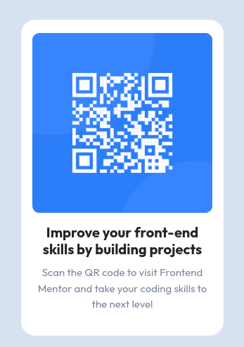

# Frontend Mentor - QR code component solution

This is a solution to the [QR code component challenge on Frontend Mentor](https://www.frontendmentor.io/challenges/qr-code-component-iux_sIO_H). Frontend Mentor challenges help you improve your coding skills by building realistic projects. 

## Table of contents

- [Overview](#overview)
  - [Screenshot](#screenshot)
  - [Links](#links)
- [My process](#my-process)
  - [Built with](#built-with)
  - [What I learned](#what-i-learned)
  - [Continued development](#continued-development)
- [Author](#author)

**Note: Delete this note and update the table of contents based on what sections you keep.**

## Overview

### Screenshot



### Links

- Solution URL: [Add solution URL here](https://your-solution-url.com)
- Live Site URL: [GitHub Page](https://fhutchins.github.io/qr-code-component/)

## My process

### Built with

- Semantic HTML5 markup
- CSS custom properties
- [Bootstrap 5.2](https://getbootstrap.com/)
- Mobile-first workflow

### What I learned

I used this challenge to practice my recently required Bootstrap 5 skills. I learnt how to combine the bootstrap card and grid features to centre the QR card.

```html
<div class="row">
  <div class="col-lg 12">
    <div class="card border-light mb-3">
      
      <div class="card-body">
        <h1>Improve your front-end skills by building projects</h1>

        <p>Scan the QR code to visit Frontend Mentor and take your coding skills to the next level</p>
      </div>
    </div>
  </div>
</div>
```


### Continued development

Responsive design is an area of web design that could still with a bit of improvement. 


## Author

- GitHub - [FHutchins](https://github.com/FHutchins)
- Frontend Mentor - [@FHutchins](https://www.frontendmentor.io/profile/FHutchins)
